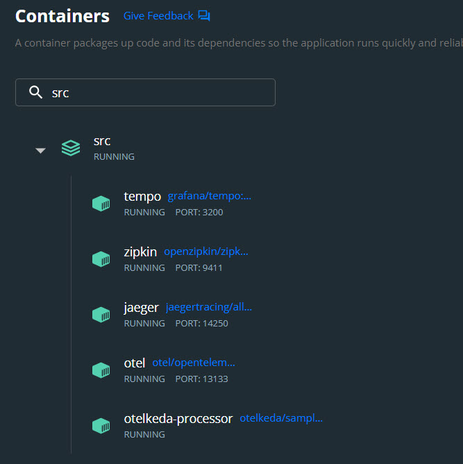
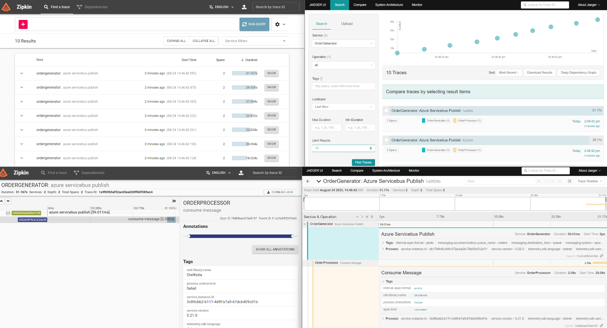

# otel-dotnet-worker-servicebus-queue
adding otel to KEDA dotnet-worker-servicebus-queue


## Setup

This setup will go through creating an Azure Service Bus queue.

### Creating a new Azure Service Bus namespace & queue

We will start by creating a new Azure Service Bus namespace:

```cli
❯ az servicebus namespace create --name otelkeda --resource-group rg-otel --sku basic
```

After that, we create an `orders` queue in our namespace:

```cli
❯ az servicebus queue create --namespace-name otelkeda --name orders --resource-group rg-otel
```

We need to be able to connect to our queue, so we create a new authorization rule with `Listen` permissions which our app will use to process messages.

```cli
❯ az servicebus queue authorization-rule create --resource-group rg-otel --namespace-name otelkeda --queue-name orders --name order-consumer --rights Listen
```

Once the authorization rule is created, we can list the connection string as following:

```cli
❯ az servicebus queue authorization-rule keys list --resource-group rg-otel --namespace-name otelkeda --queue-name orders --name order-consumer

```

## Run locally via Docker Compose

Make sure to configure the connectionstring to SB:
* docker-compose.override.yml
* OtelKeda.Dotnet.OrderGenerator/Program.cs


```
# infra only (backends and otel collector)
docker compose --profile infra up -d
docker compose --profile infra down

# infra and apps
docker compose --profile infra --profile app up -d
docker compose --profile infra --profile app down

# infra except otel
docker compose --profile backend up -d
docker compose --profile backend down

```

The docker compose runs 
* OTEL collector
* ZIPKIN, JAEGER and TEMPO backends
* APP (order processor)



traces propagated to Zipkin and Jaeger

